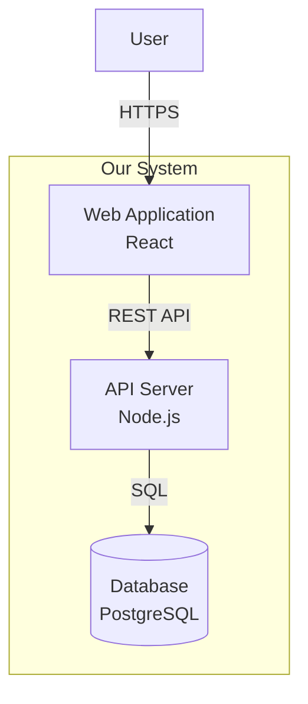

# Architecture Diagrams

This directory contains visual representations of the system architecture.

## Directory Organization

```
diagrams/
├── system-context/        # High-level system context diagrams
├── containers/            # Container/service architecture diagrams
├── components/            # Component-level diagrams
├── deployment/            # Deployment and infrastructure diagrams
├── data-flow/            # Data flow and sequence diagrams
├── integration/          # Integration patterns and external systems
└── security/             # Security architecture diagrams
```

## Diagram Types

### System Context Diagrams
- Show the system boundary
- External actors and systems
- High-level interactions
- **Audience:** Stakeholders, Product Owners, Management

### Container Diagrams
- Major containers (apps, services, databases)
- Technology choices
- Communication protocols
- **Audience:** Architects, Tech Leads, External Teams

### Component Diagrams
- Internal structure of containers
- Module boundaries
- Key components and their responsibilities
- **Audience:** Developers, Tech Leads

### Deployment Diagrams
- Infrastructure layout
- Servers, containers, cloud services
- Network topology
- **Audience:** DevOps, Infrastructure Team

### Data Flow Diagrams
- How data moves through the system
- Transformations and storage
- Security boundaries
- **Audience:** Security Team, Architects, Compliance

### Integration Diagrams
- External system integrations
- API contracts
- Event flows
- **Audience:** Tech Leads, Integration Teams

### Security Diagrams
- Security zones and boundaries
- Authentication/authorization flows
- Encryption points
- **Audience:** Security Team, Architects

## Naming Convention

```
[diagram-type]-[component-name]-[YYYY-MM-DD].[extension]

Examples:
system-context-ecommerce-platform-2024-01-15.png
container-payment-service-2024-01-20.svg
component-user-module-2024-02-01.drawio
deployment-production-aws-2024-02-10.png
```

## Tools and Formats

**Recommended Tools:**
- **Draw.io / diagrams.net** - Free, web-based, .drawio format
- **PlantUML** - Text-based diagrams, version control friendly
- **Mermaid** - Markdown-based diagrams
- **Lucidchart** - Professional diagramming tool
- **C4 Model** - For system architecture (context, containers, components, code)

**Preferred Formats:**
- **Source:** .drawio, .plantuml, .mermaid (version controllable)
- **Export:** .svg (scalable), .png (compatibility)
- **Avoid:** .jpg (lossy compression)

## Diagram Standards

### Visual Consistency
- Use consistent colors for layer types
  - Presentation: Light Blue
  - Application: Green
  - Domain: Yellow
  - Infrastructure: Orange
  - External: Gray
- Use consistent shapes
  - Rectangles: Components/Services
  - Cylinders: Databases
  - Circles: External actors
  - Clouds: External systems
- Use arrows consistently
  - Solid: Synchronous calls
  - Dashed: Asynchronous/events
  - Bold: Primary data flow

### Labels and Annotations
- Every box should have a clear label
- Include technology choices where relevant
- Add brief descriptions for complex components
- Use consistent terminology from copilot-instructions.md

### Version Control
- Keep source files (.drawio, .plantuml) in this directory
- Export to image formats for documentation
- Update date in filename when diagram changes
- Keep old versions for 2 sprints (historical reference)

## Maintenance

### When to Update Diagrams
- **Always:** When architecture changes significantly
- **Sprint Start:** Review if new features affect architecture
- **ADR Created:** Update relevant diagrams to reflect decision
- **Quarterly:** Review all diagrams for accuracy

### Review Checklist
- [ ] Diagram matches current implementation
- [ ] All components are labeled
- [ ] Technology choices are current
- [ ] External dependencies are shown
- [ ] Security boundaries are clear
- [ ] Date in filename is current
- [ ] Exported to both .svg and .png
- [ ] Referenced in relevant ADRs or architecture docs

## Integration with AI-Driven Development

### For Architects
- Create diagrams when defining initial architecture
- Update diagrams when ADRs change architecture
- Reference diagrams in `.github/project-architecture.md`
- Use diagrams in sprint planning to explain context

### For Tech Leads
- Reference diagrams in user story "Technical Context" section
- Use diagrams to explain integration patterns to AI agents
- Update component diagrams when module boundaries change

### For Developers
- Read relevant diagrams before starting a story
- Suggest updates if implementation differs from diagram
- Use diagrams to understand system context

## Example Diagram Templates

### System Context (PlantUML)
```plantuml
@startuml
!include https://raw.githubusercontent.com/plantuml-stdlib/C4-PlantUML/master/C4_Context.puml

LAYOUT_WITH_LEGEND()

title System Context - [Project Name]

Person(customer, "Customer", "A user of the system")
System(system, "Our System", "Provides [functionality]")
System_Ext(payment, "Payment Gateway", "Processes payments")

Rel(customer, system, "Uses", "HTTPS")
Rel(system, payment, "Processes payments via", "REST/JSON")

@enduml
```

### Container Diagram (Mermaid)


## Related Documents

- `.github/project-architecture.md` - References these diagrams
- `docs/architecture/adr/` - ADRs may reference specific diagrams
- `.github/copilot-instructions.md` - Architecture rules reflected in diagrams
